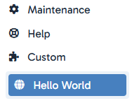

# hubleto-hello-world-app

A hello world app for Hubleto.

This is the example how to develop and publish **your external** Hubleto apps.

To install this app, first install your `hubleto/erp` (see [this guide](https://github.com/hubleto/erp)). Then, in your project folder run:

```
composer require wai-blue/hubleto-hello-world-app
php hubleto app install HubletoApp\External\WaiBlue\HelloWorld
```

You will find the app under the `Custom` button in the Hubleto sidebar.

